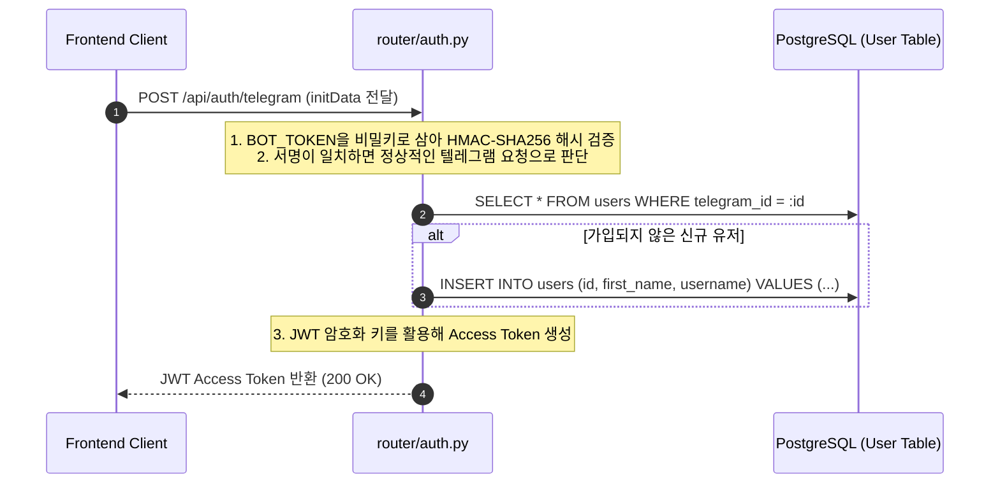

# External Reports Hub Backend Flow

이 문서는 **External Reports Hub의 백엔드 애플리케이션(`ssh-reports-hub-fastAPI`)**의 동작 구조, 의존성 주입, 그리고 백그라운드 태스크 처리 흐름을 설명하여, 다른 LLM이 코드 전체를 분석하지 않고도 백엔드 비즈니스 흐름을 바로 파악하도록 돕습니다.

---

## 1. 백엔드 아키텍처 및 라우팅 흐름 (Backend Architecture)

본 백엔드는 **FastAPI** 프레임워크를 기반으로 하며, 데이터베이스 연결 제어를 위해 **SQLAlchemy (PostgreSQL)** ORM을 사용하고, 빠른 조회를 위해 **In-Memory Cache (Redis 또는 파이썬 내장 캐시)** 레이어를 적용하고 있습니다.

```mermaid
flowchart TD
    %% 클라이언트 유입
    Client["Client App / Telegram WebApp"] -->|HTTP Request| FastAPI_Main["app/main.py\n(FastAPI Engine)"]

    %% 미들웨어 및 라우터 레이어
    subgraph "FastAPI Engine & Router"
        FastAPI_Main --> SecurityMiddleware["Security Middleware\n(CORS / Error Handlers)"]
        SecurityMiddleware --> APIRouters["app/routers/\n(API Endpoint Routers)"]
    end

    %% 라우터별 역할 세분화
    subgraph "API Endpoints"
        APIRouters --> Router_Auth["auth.py\n(텔레그램 해시 검증 & JWT 생성)"]
        APIRouters --> Router_Reports["reports.py\n(리포트 쿼리, 즐겨찾기 토글)"]
        APIRouters --> Router_Users["users.py\n(알림 키워드 및 내 정보 관리)"]
    end

    %% 비즈니스 로직 및 외부 연동 서비스
    subgraph "Business Managers"
        Router_Reports --> AntigravityManager["antigravity_manager.py\n(PDF 동기화 및 가공 핵심 코어)"]
        Router_Reports --> DeepseekManager["deepseek_manager.py\n(AI 세 줄 요약 전송 처리)"]
    end

    %% 데이터 액세스 레이어
    subgraph "Database & Cache"
        T_DB["app/database.py\n(PostgreSQL Engine & Session)"]
        T_Models["app/models.py\n(SQLAlchemy ORM Entities)"]
        T_Cache["app/cache.py\n(리포트 목록 및 세션 캐싱)"]
    end

    Router_Auth -->|Read / Write User| T_Models
    Router_Reports -->|Read Cache| T_Cache
    Router_Reports -->|Query DB| T_Models
    Router_Users -->|Update Keywords| T_Models

    T_Models -->|Read/Write Session| T_DB
end
```

---

## 2. 핵심 비즈니스 로직 시퀀스 (Core Business Logic Flow)

### 2.1 텔레그램 미니앱 인증 및 토큰 검증 흐름


### 2.2 리포트 PDF 동기화 및 아카이빙 비동기 트리거
수집기(Scrapers)가 신규 리포트 레코드를 `tbl_sec_reports` 테이블에 적재하면 백엔드 내부의 **`AntigravityManager`**와 **`PdfArchiver`**가 연동되어 아래 단계를 진행합니다.
1. `download_status_yn`이 N이거나 누락인 건을 스캔합니다.
2. 해당 건의 `download_url`로 PDF 직접 다운로드를 수행합니다.
3. 다운로드 완료 시 PDF 메타데이터(총 페이지 수, 텍스트 포함 여부, 크기 등)를 추출하여 `tbl_sec_reports_pdf_archive` 테이블에 저장합니다.
4. 추출된 PDF를 Object Storage에 영구 저장하고 획득한 URL을 `tbl_sec_reports`에 업데이트합니다.

---

## 3. 핵심 모듈 및 도메인 파일 정의

* **`app/models.py`**: 데이터베이스 설계에 해당하는 `User`, `SecReport`, `PdfArchive`, `FnGuideReportSummary` 등의 SQLAlchemy 스키마 정의 파일입니다.
* **`app/antigravity_manager.py`**: PDF 다운로드 유효성을 정밀 검사하고, 미수집 또는 아카이빙 장애 건을 일괄 복구하는 핵심 제어 연산 모듈입니다.
* **`app/deepseek_manager.py`**: DeepSeek 및 LLM API를 사용하여 리포트 내 주요 문단을 요약 분석하고 감성 분석 수치를 도출해 내는 핵심 AI 연동 파트입니다.
* **`app/cache.py`**: 잦은 필터 및 검색 조회로부터 발생하는 PostgreSQL의 부하를 획기적으로 낮추기 위한 캐시 제어 로직입니다.
